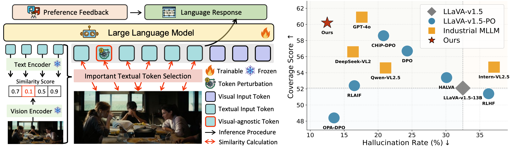

<div align="center">
  <h2 style="font-size: 36px; font-weight: bold; color: #333;">
    TARS: MinMax Token-Adaptive Preference Strategy for Hallucination Reduction in MLLMs
  </h2>
  <h4 style="font-size: 20px; color: #777; font-style: italic;">
    A tribute to TARS from <i>Interstellar</i> — not piloting through wormholes, but steering MLLMs away from the gravity of hallucination.
  </h4>
</div>

<div align="center" style="margin-top: 20px;">
  <!-- GitHub Badges -->
  
  
  <a href="https://arxiv.org/abs/2507.21584">
    
  </a>
  <a href="https://kejiazhang-robust.github.io/tars_web/">
    
  </a>
  
  
</div>

<div align="center" style="margin-top: 30px;">
  <h3 style="font-size: 24px; font-weight: bold; color: #333;">
    Kejia Zhang, Keda Tao, Zhiming Luo, Chang Liu, Jiasheng Tang, Huan Wang
  </h3>
</div>

<!-- LOGO -->
<div align="center" style="margin-top: 20px;">
  
</div>

---

## 📖 Paper Teaser

<div align="center" style="margin-top: 20px;">
  
</div>

<div align="center" style="margin-top: 15px;">
  <p style="font-size: 12px; font-weight: 500; color: #444;">
    <b>Left:</b> We present <i>TARS</i>, a <u>t</u>oken-<u>a</u>daptive p<u>r</u>eference <u>s</u>trategy for mitigating hallucinations in MLLMs.  
    TARS reformulates Direct Preference Optimization (DPO) as a min-max objective that  
    (1) minimizes behavioral misalignment via preference feedback, and  
    (2) maximizes adaptability through perturbations of visual-agnostic tokens.  
    <br><br>
    <b>Right:</b> Evaluation on LLaVA-v1.5-13B and industrial MLLMs under the AMBER benchmark  
    shows that TARS consistently outperforms standard DPO baselines and matches GPT-4o in hallucination suppression.
  </p>
</div>

---

## 🚀 News

📢 **[2025-07-28]** TARS is now **open-source**! Check out the repo and get started. 🔥

---

# 🧪 Quick Start

## 📦 Environment Setup

```bash
conda create -n DPO python=3.10 -y
conda activate DPO
pip install -e .
```

## 🔧 Base Models

We conduct experiments based on the following pretrained models:

- [LLaVA-V1.5-7B](https://huggingface.co/liuhaotian/llava-v1.5-7b)
- [LLaVA-V1.5-13B](https://huggingface.co/liuhaotian/llava-v1.5-13b)

## 📊 Hallucination Benchmarks

We evaluate hallucination suppression performance on several widely-used benchmarks:

- [POPE](https://github.com/RUCAIBox/POPE)
- [MME-Bench](https://github.com/BradyFU/Awesome-Multimodal-Large-Language-Models/tree/Evaluation)
- [AMBER](https://github.com/junyangwang0410/AMBER)
- [Object HalBench](https://github.com/RLHF-V/RLHF-V/tree/main)
- [MMHal-Bench](https://huggingface.co/datasets/Shengcao1006/MMHal-Bench)

## 📁 DPO Dataset

We adopt the [RLHF-V-Dataset](https://huggingface.co/datasets/openbmb/RLHF-V-Dataset) and sampled a subset of 4.8k data for training.

## 🚀 Run TARS-DPO

To launch training with our TARS-DPO strategy, simply run:

```bash
bash scripts/TARS.sh
```

---

## 📌 Citation

If you find our work helpful, please consider citing our paper:

```

```

Your citation helps support our research and further advances the field of reliable vision-language models. 🚀
