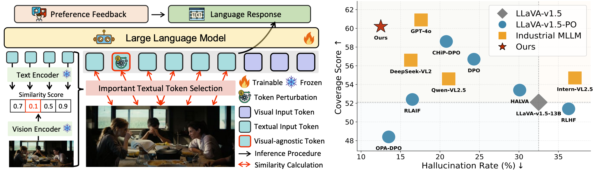

<div align="center">
  <h2 style="font-size: 36px; font-weight: bold; color: #333;">
    TARS: MinMax Token-Adaptive Preference Strategy for MLLM Hallucination Reduction
  </h2>
  <h4 style="font-size: 20px; color: #777; font-style: italic;">
    A tribute to TARS from <i>Interstellar</i> — not piloting through wormholes, but steering MLLMs away from the gravity of hallucination.
  </h4>
</div>

<div align="center" style="margin-top: 20px;">
  <!-- Publication / GitHub Badges -->
  <a href="https://eccv.ecva.net/">
    
  </a>
  <a href="https://arxiv.org/abs/2507.21584">
    
  </a>
  <a href="https://kejiazhang-robust.github.io/tars_web/">
    
  </a>
  
  
</div>

<div align="center" style="margin-top: 30px;">
  <h3 style="font-size: 24px; font-weight: bold; color: #333;">
    Kejia Zhang, Keda Tao, Zhiming Luo, Chang Liu, Jiasheng Tang, Huan Wang
  </h3>
</div>

<!-- LOGO -->
<div align="center" style="margin-top: 20px;">
  
</div>

---

## 📰 News

- **[2026-06-18]** 🎉 TARS is accepted to **ECCV 2026**! This repository hosts the camera-ready release.
- **[2026-06-18]** TARS is **open-sourced**. 🔥

---

## 📖 Overview

<div align="center" style="margin-top: 20px;">
  
</div>

<div align="center" style="margin-top: 15px;">
  <p style="font-size: 12px; font-weight: 500; color: #444;">
    <b>Left:</b> We present <i>TARS</i>, a <u>t</u>oken-<u>a</u>daptive p<u>r</u>eference <u>s</u>trategy for mitigating hallucinations in MLLMs.
    TARS reformulates Direct Preference Optimization (DPO) as a min-max objective that
    (1) minimizes behavioral misalignment via preference feedback, and
    (2) maximizes adaptability through perturbations of visual-agnostic tokens.
    <br><br>
    <b>Right:</b> Evaluation on LLaVA-v1.5-13B and industrial MLLMs under the AMBER benchmark
    shows that TARS consistently outperforms standard DPO baselines and matches GPT-4o in hallucination suppression.
  </p>
</div>

---

# 🧪 Quick Start

## 📦 Environment Setup

```bash
conda create -n DPO python=3.10 -y
conda activate DPO
pip install -e .
```

## 🔧 Base Models

We conduct experiments based on the following pretrained models:

- [LLaVA-V1.5-7B](https://huggingface.co/liuhaotian/llava-v1.5-7b)
- [LLaVA-V1.5-13B](https://huggingface.co/liuhaotian/llava-v1.5-13b)

## 📁 Preference Dataset

We adopt the [RLHF-V-Dataset](https://huggingface.co/datasets/openbmb/RLHF-V-Dataset) and sample a subset of 4.8k pairs for training. Download the parquet file and point `--data_path` at it in the training script.

## 🚀 Training (TARS-DPO)

Edit the paths in [scripts/train/TARS.sh](scripts/train/TARS.sh) (`model_name_or_path`, `vision_tower`, `data_path`, `output_dir`), then launch:

```bash
bash scripts/train/TARS.sh
```

Training uses DeepSpeed ZeRO-3 ([scripts/zero3.json](scripts/zero3.json)). Key TARS knobs exposed in the script:

| Flag | Meaning |
|---|---|
| `--use_image_type diffusion` | Visual-agnostic perturbation (`diffusion`, `black`, `crop`, `rotate`, `random`) |
| `--diffusion_step` | Noise strength for diffusion perturbation |
| `--tok_beta` | Token-level DPO temperature |
| `--dpo_token_weighted` / `--dpo_token_weight` | Token-reweighted preference loss |
| `--use_tdpo` / `--use_cross_modal_loss` | Optional objective variants |

## 📊 Evaluation

We evaluate hallucination suppression on the following benchmarks. See [scripts/eval/README.md](scripts/eval/README.md) for per-benchmark instructions.

- [POPE](https://github.com/RUCAIBox/POPE)
- [MME-Bench](https://github.com/BradyFU/Awesome-Multimodal-Large-Language-Models/tree/Evaluation)
- [AMBER](https://github.com/junyangwang0410/AMBER)
- [Object HalBench](https://github.com/RLHF-V/RLHF-V/tree/main)
- [MMHal-Bench](https://huggingface.co/datasets/Shengcao1006/MMHal-Bench)

---

## 📌 Citation

If you find our work helpful, please consider citing:

```bibtex
@inproceedings{zhang2026tars,
  title     = {TARS: MinMax Token-Adaptive Preference Strategy for Hallucination Reduction in MLLMs},
  author    = {Zhang, Kejia and Tao, Keda and Luo, Zhiming and Liu, Chang and Tang, Jiasheng and Wang, Huan},
  booktitle = {Proceedings of the European Conference on Computer Vision (ECCV)},
  year      = {2026}
}
```

Your citation helps support our research and further advances the field of reliable vision-language models. 🚀

---

## 🙏 Acknowledgements

This codebase is built on top of [LLaVA](https://github.com/haotian-liu/LLaVA) and [RLHF-V](https://github.com/RLHF-V/RLHF-V). We thank the authors for releasing their code.

## 📄 License

This project is released under the [Apache 2.0 License](LICENSE).
